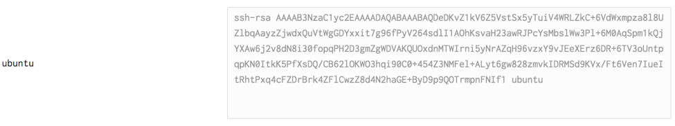

## Описание проекта

Представьте себе, что вы вместе с несколькими коллегами были наняты в компанию, которая собирается стать `data-driven`. Ваша задача помочь ей в этом со своей стороны: сделать данные доступными для разных пользователей. 

У вас будет 3 подпроекта и подготовительный этап.

1. Подготовительный этап: развертывание кластера, сбор кликстрима с сайта компании (e-commerce магазин).
2. Данные для **конечного пользователя**: создание качественного поиска по товарам.
3. Данные для **аналитиков**: создание витрин данных о пользовательском поведении на сайте и о покупках.
4. Данные для **менеджеров**: дэшборды о посещаемости сайта, конверсии, среднем чеке и объеме продаж для принятия управленческих решений.

### Подготовительный этап

Поскольку бюджет на инфраструктуру в вашей компании пока еще не согласован, вам нужно реализовать пилот в облаке. <a href="https://cloud.google.com">Google Cloud Platform</a> предоставляет free trial аккаунт с 300$ на счету, которые можно использовать для нужд проекта. Этого должно хватить на весь пилот при аккуратном использовании. **В частности, нужно выключать машины, когда они не используются** (!!!).

В этом облаке вам надо:

1. поднять свой кластер из 4 серверов,
2. установить Hadoop, используя Hortonworks дистрибутив,
3. подключить к сайту сбор кликстрима,
4. развернуть и настроить Kafka в качестве центральной шины данных.

Вам нужен один "чистовой" кластер на команду, на котором вы будете проверять свое финальное решение. Однако вероятно, что для распределенной работы команды, неплохо, чтобы у каждого члена был свой кластер.

#### 1. Заказ серверов

Зайдите в раздел `Metadata` (карточка Compute Engine), далее во вкладку `SSH Keys`. Сюда вы можете вставить значение вашего pub-ключа, чтобы потом зайти на любую машину со своим private-key. <a href="https://cloud.google.com/compute/docs/instances/adding-removing-ssh-keys">Здесь на GPC</a> подробно написано, как можно создать свой ключ с нуля на MacOS и Windows. В итоге после добавления ключа у вас должно получиться что-то такое:

Далее вам нужно будет попасть в раздел `Compute Engine`, после чего в подраздел `VM Instances`, где мы и создадим 4 виртуальных машины для нашего кластера.

Тип машины: `4 vCPUs, 15 GB memory`. Операционная система: `Ubuntu 16.04 и диск на 30 ГБ`.

*Размер диска поменять?*

Создайте 2 таких машины в регионе `europe-west1-b` и еще 2 в регионе `europe-west2-b`. К сожалению, у GCP есть квоты на количество CPU в одном регионе, которые можно изменить только, если у вас не free-аккаунт. На них вы автоматом сможете зайти с тем ключом, который добавили ранее. 

Следующее действие — зарезервировать статический IP для вашей мастер-ноды. Это потребует примерно $$10 из тех $300 за всё время пилота. Поскольку придется включать и выключать машины, то для дальнейшего удобства это будет необходимо. Для этого перейдите из раздела `Compute Engine` в раздел `VPC Network`. Далее вкладка `External IP addresses`. Там в списке ваших серверов найдите тот, который вы собираетесь сделать мастер-нодой, и нажмите на `Ephemeral`. Там можно сделать резерв этого IP в качестве статического.

**Важно! Скиньте этот IP вашему координатору**.

*Snapshots*

#### 2. Установка Hortonworks HDP

Подробный мануал о том, как устанавливать HDP через Ambari изложен <a href="HDP.md">здесь</a>. Решили вынести это в отдельный документ, потому что часть из вас это может выполнить полузакрытыми глазами.

*Раскидывание ролей по машинам*

*Размер блока HDFS. Фактор репликации HDFS. Размер памяти для mapreduce операций. Размер контейнера YARN.*

#### 3. Развертывание своего сайта

Существует удобная возможность поработать с сайтом e-commerce. Для этого нужно зарегистрироваться на 1С-Битрикс. Там вы сможете поднять свой маленький магазин с контентом и ценами. После чего мы будем присылать на ваш сайт клики, имитируя пользовательское поведение.

*Инструкция*

*Сбор кликстрима через Divolte или нет*

#### 4. Настройка Kafka

*Какие-то настройки и лайфхаки*