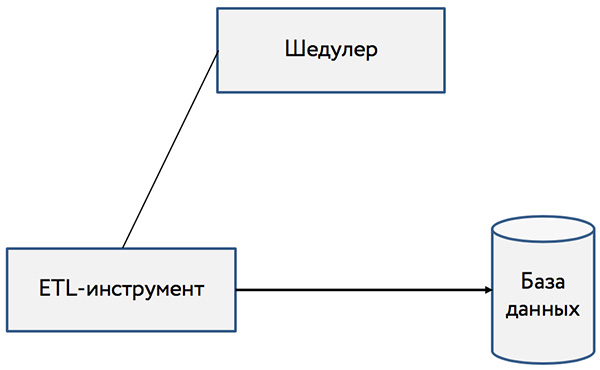

### Этап №2: Данные для аналитиков

Ваши аналитики хотят иметь свежую информацию о пользовательском поведении на сайте и о сделанных покупках. Это позволит им предложить отделу маркетинга те страницы товаров, которые требуют улучшения конверсии, отделу продаж — те товары, на которые вероятно стоит изменить цену в ту или иную сторону.

С вашей стороны вам нужно:

1. Каждый час обновлять данные в базе данных о пользовательском поведении и о покупках,
2. таблица о пользовательском поведении должна содержать следующие поля: `url`, `id товара`, `кол-во просмотров`, `глубина просмотра`,
3. таблица о покупках должна содержать следующие поля: `url`, `id товара`, `количество покупок`, `сумма покупок`,
4. выбор шедулера, инструмента ETL и базы данных нужно подкрепить исследованием и бенчмарком,
5. отклик базы данных нужно оптимизировать для достижения уровня latency не больше N ms.

#### Выбор инструментов

Весь пайплайн выглядит следующим образом:

Вам необходимо подобрать шедулер, который по расписанию будет запускать скрипт или джобу ETL-инструмента, который опять же нужно выбрать. Всё это кладется в базу данных, которую необходимо также подобрать. Для всех этих инструментов необходимо провести исследование и бенчмарк (*ссылка на шаблон и образец исследования*) и сделать обоснованный выбор.

#### Настройка и оптимизация инструментов

Уровень latency отклика базы данных не должен превышать N (*определить*) милисекунд.

#### Проверка

*Чекер будет проверять...*

**Все действия по написанию отчетов и конфигурационных файлов необходимо выполнять в репозитории команды на GitHub.**