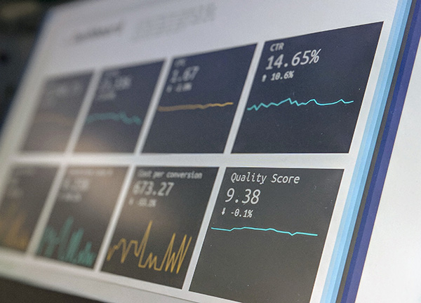

### Этап №3: Данные для менеджеров

Ваши менеджеры хотят иметь в режиме real-time информацию пользовательском поведении, чтобы оперативно принимать решения об изменении цен на товары, каналах привлечения клиентов и т.д. За этим удобно следить на дэшбордах.

С вашей стороны вам нужно:

1. создать 5 дэшбордов: 

2. 1. число посетителей на сайте за каждые 5 минут,
   2. число заказов за каждые 5 минут,
   3. конверсия в заказ в течение 1 часа,
   4. средний чек заказа инкрементальный с обновлением каждый час,
   5. общая сумма продаж инкрементальная с обновлением каждые 30 минут.

3. выбор инструмента ETL, базы данных и инструмента визуализации нужно подкрепить исследованием и бенчмарком,

4. отклик базы данных нужно оптимизировать для достижения уровня latency не больше N ms (*определить*).

Дэшборды выглядят примерно так:

*скриншот*

#### Выбор инструментов

Вам нужно собирать данные из Kafka, обрабатывать их соответствующим образом в ETL-инструменте real-time, складывать это в подходящую базу данных и визуализировать в виде дэшборда.

#### Проверка

*Чекер будет проверять...*

**Все действия по написанию отчетов и конфигурационных файлов необходимо выполнять в репозитории команды на GitHub.**

